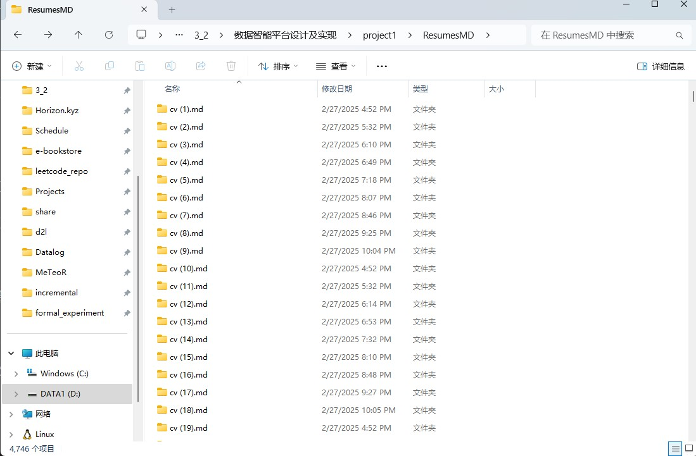
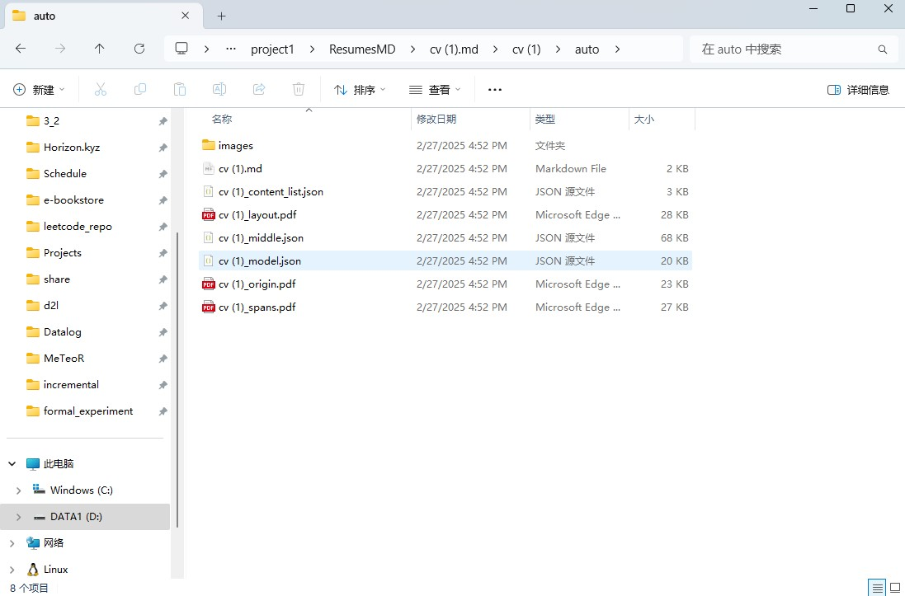
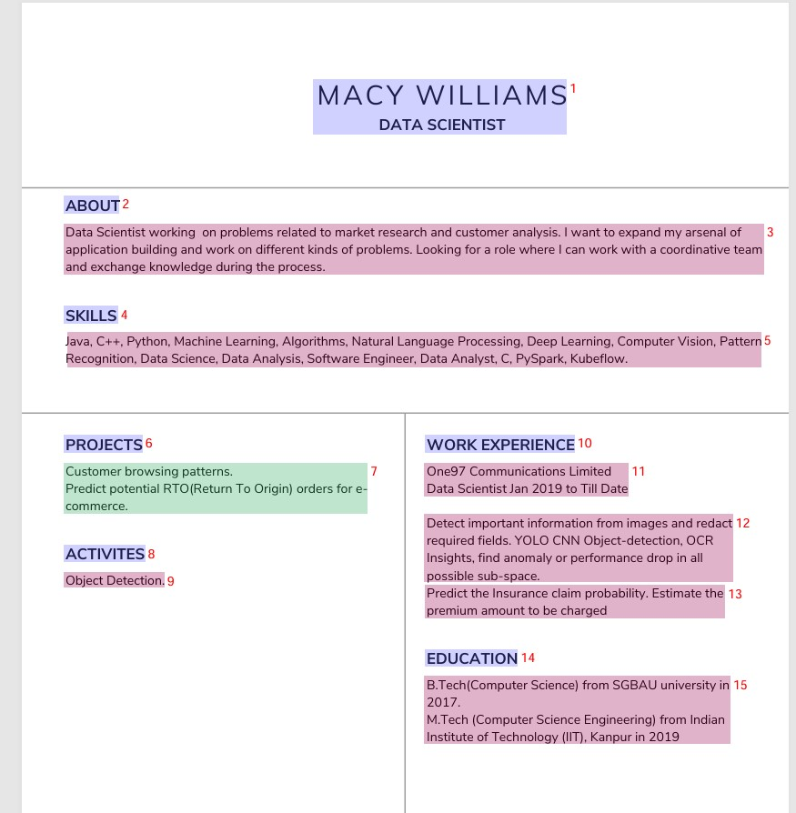
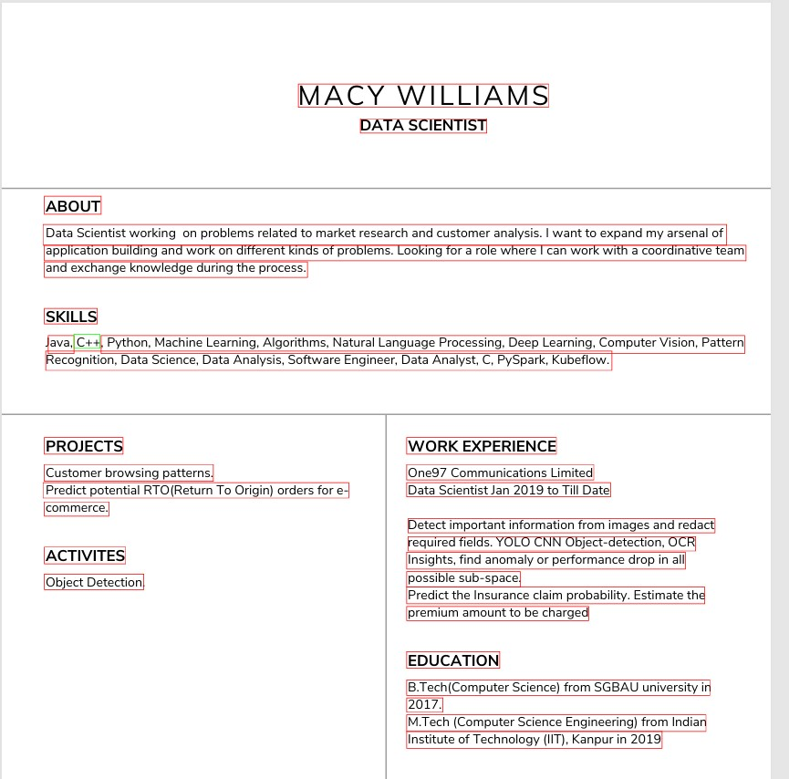
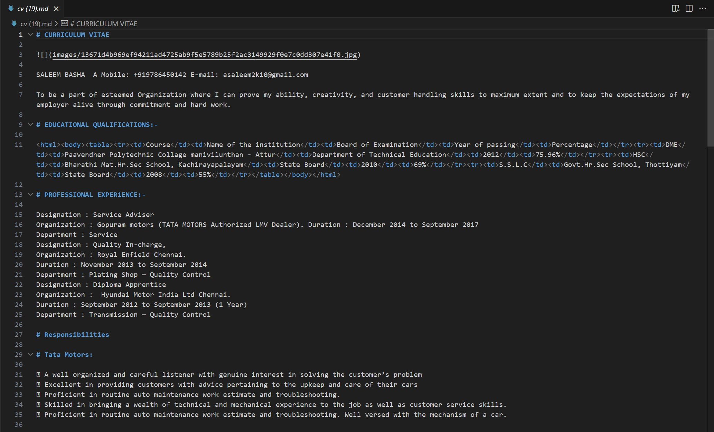
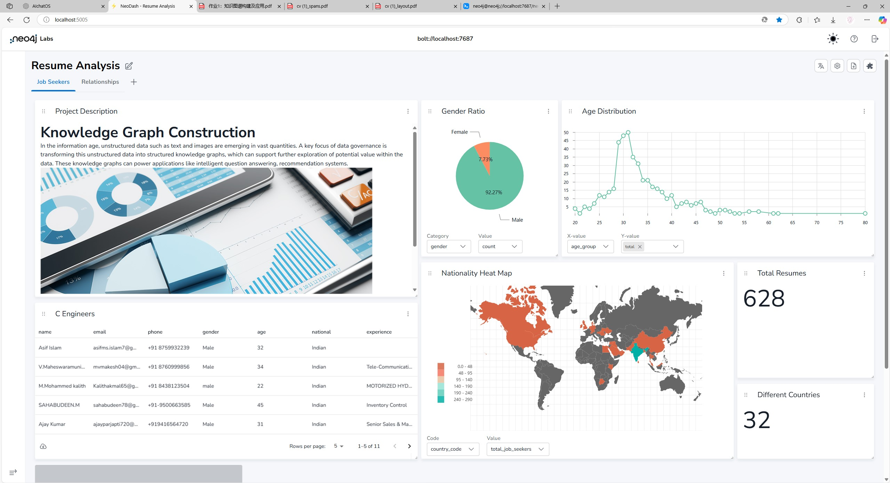
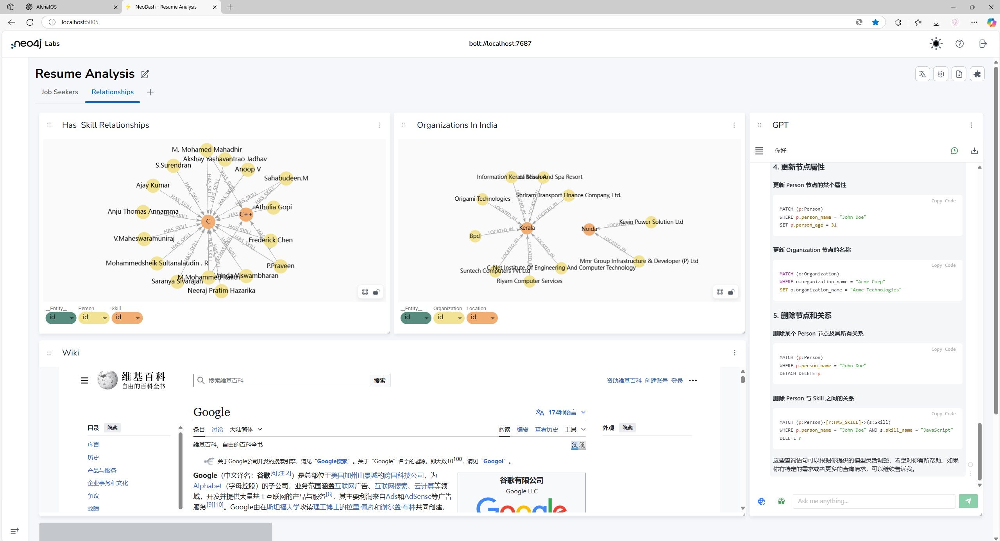

## 作业描述：非结构化数据的知识图谱构建

目的：随着信息时代的到来，非结构化数据如文本、图像等海量涌现。数据治理的重点往往就是将这些非结构化数据转化为结构化的知识图谱，支持后续进一步挖掘数据中的潜在价值，为智能问答、推荐系统等诸多应用提供支持。本次作业中，需要通过实体关系提取等处理，将非结构化文本数据转换为知识图谱并存储到 Neo4j 图数据库，从而掌握行业知识图谱构建流程。简历数据通常包含丰富的信息，如个人信息、教育背景、工作经验、技能等。这些信息是非结构化的，需要通过自然语言处理技术进行提取和结构化。通过构建知识图谱，可以将这些信息以图形的形式展现，便于查询和分析，从而为人力资源管理系统、HR 招聘系统等提供支持，实现对特定技能和工作经验的候选人的快速推荐。其大致流程如下：

## 简要流程

### 环境准备

1. docker-compose 部署 neo4j 数据库，安装了 apoc 插件

### [采]简历读取：

**要求**：从文件夹中读取简历，读取方式自行设定。并从 PDF 格式的简历文件中提取文本内容，为后续的文本分析和知识图谱构建提供数据基础。

**思路**：首先采用了 pdf2txt 的 python 库、将 pdf 转化为 txt 格式的文件、但是感觉效果不太理想，因为生成的 txt 也是非结构化的、不易于 ai 去进行分析和理解、同时有些简历中涉及了表格、txt 格式无法有效地表示。同时，llm 的生成和表述也经常通过 markdown 的格式进行描述、所以后续采用了 pdf2markdown 的方式进行处理，即将所有 pdf 文件转化为对应的 markdown 文件。

最终这里使用 MinerU 的 docker 启动方式进行处理，在本地使用 GPU + CUDA 运行处理 pdf 转换的任务（https://github.com/opendatalab/MinerU?tab=readme-ov-file）使用Dockerfile在本地打包后运行脚本(convert_pdf_to_md.sh)自动处理。这里发现如果单进程去跑这个转换成 md 文件的模型、gpu 利用率不高、因此开了 5 个容器进程让它并行地去跑、不然太慢了。（使用了 splitPDF.py 脚本将这 5000 份 pdf 平均分为每 1000 份的 5 份）

```shell
wget https://github.com/opendatalab/MinerU/raw/master/docker/global/Dockerfile -O Dockerfile
docker build -t mineru:latest .
docker run -it --name mineru1 --gpus=all -v $PWD/ResumesPDF/ResumesPDF_1:/ResumesPDF -v $PWD/ResumesMD:/ResumesMD -v $PWD/convert_pdf_to_md.sh:/convert_pdf_to_md.sh mineru:latest /bin/bash -c "echo 'source /opt/mineru_venv/bin/activate' >> ~/.bashrc && exec bash"
./convert_pdf_to_md.sh
```

此外，这批 pdf 数据中包含着无法正常打开的简历文件，在转化处理过程中同时进行了自动的数据清洗和预处理操作。

下图是 MinerU 的运行结果，分别包括了简历 PDF 转 Markdown 的结果，其中将 pdf 分块监测的步骤，以及最终的 markdown 文本结果：











### [治]知识图谱构建：

**要求**：使用 LTP（Language Technology Platform）对提取的文本进行分析，提取关键信息并构建知识图谱。（注：LTP 支持对文本进行分词、词性标注、命名实体识别、依存句法分析和语义角色标注等功能，实际使用内容自行选定）从分析结果中提取关键信息，如工作经验、教育背景、技能等信息，为每个类别的关键信息（工作经验、教育背景、技能、项目）创建节点，并在这些节点之间创建关系，完成知识图谱的构建。

**思路**：采用 langchain-neo4j 库，将 markdown 文件读入成字符串后、调用库中的函数进行知识图谱的生成和处理，注意这里可以选择需要的节点种类和关系种类（即可以自定义需要的关系，然后让 llm 根据输入的简历内容进行 neo4j 数据的生成），然后将处理后的结果导入到 neo4j 数据库中。让 llm 进行分类处理的节点、节点属性以及关系如下：

```python
# Location: 单独将“Location”作为一个节点类型，用于表示地理位置（城市、国家等），而不是作为属性。这样可以更好地支持地理位置的查询和分析。
allowed_nodes = [
    "Person", "Organization", "Skill", "Certification", "Location"
]

allowed_relationships = [
    ("Person", "WORKED_AT", "Organization"),
    ("Person", "HAS_SKILL", "Skill"),
    ("Person", "HAS_CERTIFICATION", "Certification"),
    ("Person", "LIVES_IN", "Location"),
    ("Certification", "RELATED_TO", "Skill"),
    ("Organization", "LOCATED_IN", "Location"),
]

# 设置了 node_properties 参数允许提取节点属性，从而创建更详细的图谱。当设置为 True 时，LLM 会自动识别并提取相关的节点属性。相反，如果 node_properties 被定义为字符串列表，LLM 将只从文本中选择性地提取指定的属性。
node_properties = [
    # Person
    "person_name", "person_email", "person_phone", "person_address", "person_gender", "person_age","person_national","person_project",
    # Organization
    "organization_name", "organization_type",
    # Skill
    "skill_name", "skill_type",
    # Certification
    "certification_name", "certification_issue_date", "certification_type",
    # Location
    "location_city", "location_country",
]
```

### [存]知识图谱存储：

**要求**：使用 Neo4j 图形数据库存储提取的关键信息和关系，实现知识图谱的持久化。

**思路**：这里存储的时候使用了 baseEntityLabel=True 参数，即打开了索引。大多数图数据库都支持索引功能，以优化数据导入和检索的效率。在某些情况下，我们可能无法提前知道所有的节点标签（node labels）。为了应对这种情况，我们可以使用 baseEntityLabel 参数给每个节点添加一个额外的基础标签（secondary base label）。同时会有重名的现象、所以打开了 include_source=True 参数、可以追溯不同文件。

```python
graph.add_graph_documents(graph_documents_filtered, baseEntityLabel=True, include_source=True)
```

### [算]简历筛选：

**要求**：支持通过知识图谱快速筛选符合特定职位要求的候选人，包括但不限于用 Neo4j Cypher 查询语言筛选出具有特定技能和工作经验的候选人。

**思路**：这里通过了预先设置的 agent+prompt 来基于 neo4j 数据库固定的结构生成对应的 cypher 语句、然后再结合对应的实际情况进行查询、比如我要查有 C++，python，java 都会的候选人。具体实例应用均在 neoDash 中给到。

### [用]展示应用：

**要求**：通过实际应用展示知识图谱的构建和查询结果，在这一步骤中，编写至少两个查询示例展示如何筛选符合条件的候选人，查询结果应包括候选人的关键信息，如姓名、技能、工作经验等。

**思路**：可以通过自动化根据分析后的数据进行一些图表的生成、作为这批数据处理的结果、比如职业情况分布、或者是技能分布等等，做一些统计数据的分析。这里的 dashboard 使用了官方的 neoDash，使用 docker 部署运行

```shell
docker pull neo4jlabs/neodash:latest
docker run -d --name neodash -p 5005:5005 neo4jlabs/neodash
```

neoDash 展板的效果图如下，分别包括了数据展板、处理简历数字、国家分布、图数据库查询结果、wiki 界面以及 gpt 界面：





### 用到的技术

1. MinerU：一个基于 Docker 的简历 PDF 转 Markdown 的工具，用于将简历 PDF 文件转化为 Markdown 文件。

2. langchain-neo4j：一个用于将文本数据转化为知识图谱的工具，用于将 Markdown 文件转化为知识图谱。

3. Neo4j：一个图数据库，用于存储知识图谱。

4. neoDash：一个用于展示知识图谱的展板，用于展示知识图谱的查询结果。

### 关键步骤的运行结果

下图是 MinerU 的运行结果，分别包括了简历 PDF 转 Markdown 的结果，其中将 pdf 分块监测的步骤，以及最终的 markdown 文本结果：


neoDash 展板的效果图如下，分别包括了数据展板、处理简历数字、国家分布、图数据库查询结果、wiki 界面以及 gpt 界面：


### 创新点

1. 使用 MinerU 进行简历 PDF 转 Markdown 的处理，提高了简历数据的处理效率，对 pdf 文件进行了自动的数据清洗和准确的 预处理操作，提高了知识图谱和准确度。

2. 使用 langchain-neo4j 进行知识图谱的构建，提高了知识图谱的构建效率，同时提供了丰富的节点和关系种类，提高了知识图谱的丰富度和准确度。

3. 使用 neoDash 进行知识图谱的展示，提高了知识图谱的展示效率，同时提供了丰富的展示功能，如数据展板、处理简历数字、国家分布、图数据库查询结果、wiki 界面以及 gpt 界面，提高了知识图谱的可视化效果和美观度。

### 演示视频

见附件
