## 作业 2 基于分布式数据分析的智慧能源网监测平台

参考业务：智慧能源网监测平台是一种基于物联网（IoT）、云计算、大数据分析、人工智能（AI）等技术的综合能源管理系统。它用于实时监测、分析、优化和控制各种能源（如电力、天然气、水、热能、可再生能源等）的使用情况，帮助企业、园区、城市等提升能源利用效率，降低成本，实现智能化管理和碳排放控制。本次作业基于某能源站数据集，通过大数据分析服务搭建，构建面向能源站运维的监测平台。考虑到数据采集点多，采集频率高，单机串行处理往往耗费大量时间，为了加快处理速度，可以通过分布式的服务器集群进行并行计算。本次作业需要你在三台云服务器上布置分布式计算集群，完成大规模数据采集、治理、存储、计算、使用等流程，实现能源数据存储与可视化、供能趋势预测等功能。具体流程如下：

## 实现思路

1. 基于包含采集数据的 txt 文件定时发送采集数据 模拟实时采集过程

   - txt 文件格式为<时间,数据>
   - xml 里包含了每个文件的含义 即<设备名称,字段>
   - 先用 py 处理 xml 文件 生成一个字典 其中 key 为设备名称 value 为字段列表
   - 然后采集数据时 即可逐个针对每个设备去读取数据流 组合字段形成一个完整的采集数据

2. 使用 DeltaLake(http://delta.io/learn/getting-started/)按照点位对原始
   采集数据进行存储；面向不同设备建立标准数据表，表中应包含某一设备的全部采集
   数据，并按照时间进行合并对齐，对于缺失数据进行相应处理。

   - 使用集成了 DeltaLake 的 PySpark 进行数据的读取和存储 数据以 delta 表的格式存储在本地文件系统
   - 读取数据时只需要按 1 中所说 读取每个设备的完整数据 存储前插入缺失值即可

3. 使用批处理或流处理框架，基于 DeltaLake 对供能数据进行静态和动态分析
   （1）主成分分析：分析设备的各个维度（即采集点位）数据间关系，确定能够反映设
   备运行情况的主成分数据。
   提示：可使用 PCA 算法或关联分析算法确定主成分。
   （2）报表生成：分析冷机、热机、三联供系统的综合运行情况，生成日度、周度、月
   度的综合报表。包括但不限于：峰谷值、总供能量、峰值期时长、谷值期时长等，可
   自行设计报表内容。
   提示：可使用 DeltaLake 自带的统计函数或自行实现统计函数来实现。
   （3）趋势预测：根据季节、节假日、每日峰谷潮汐变化等特征，采用时序预测算法或
   模型，预测该能源站冷机、热机、三联供系统的分钟级、小时级供能趋势。
   提示：可使用 ARIMA，Autoencoder，LSTM 等算法实现。一般可建立滑动时间窗口，
   用一段时间窗内的数据作为每个时间点的特征进行预测。

   - 三者皆可以使用 PySpark 进行实现 具体可以倒时候问 LLM

4. 将分析结果展示在 Web 界面中，要求界面清晰简洁，内容完整，展示形式丰富，应能展示上述分析结果。参考界面如下：
   （1）设备级数据查询展示界面，可以某月中日期为当前日期，展示对历史数据的查询
   能力和数据的实时更新能力。
   （2）主题数据查询展示界面：按照主题对数据进行查询，如查询温度，可查询到系统
   内所有和温度有关的采集点数据。
   （3）系统级数据综合展示界面：展示一类系统中全部的设备状态信息，同时可以查询
   到该系统的综合报表。
   （4）供能趋势预测界面：展示冷热能在不同算法下的趋势预测，结合当前设备状态、
   供能情况和预测值，给出机组操作的建议（如关停某台设备，降低设备流量等），可
   以某月中日期为当前日期，对结果进行验证。

   - 没什么好说的 写个前后端的事 采用 echarts 进行可视化展示

## 【采】

基于包含采集数据的 txt 文件定时发送采集数据，模拟实时采集过程。

数据集解释：
该数据集为某能源站采集的 2018 年 1 月、2 月、4 月、7 月、10 月的供能数据，能源站结构如下图所示，其中数据集内为北站（1 号站）的采集数据。采集点名称在 pos.ttl 中可以得到，该文件以 xml 形式表示，可通过文本编辑器直接打开。

## 【治&存】

使用 Delta Lake (http://delta.io/learn/getting-started/)按照点位对原始采集数据进行存储；面向不同设备建立标准数据表，表中应包含某一设备的全部采集数据，并按照时间进行合并对齐，对于缺失数据进行相应处理。

## 【算】

使用批处理或流处理框架，基于 Delta Lake 对供能数据进行静态和动态分析：

主成分分析：分析设备的各个维度（即采集点位）数据间关系，确定能够反映设备运行情况的主成分数据。
提示：可使用 PCA 算法或关联分析算法确定主成分。

报表生成：分析冷机、热机、三联供系统的综合运行情况，生成日度、周度、月度的综合报表。包括但不限于：峰谷值、总供能量、峰值期时长、谷值期时长等，可自行设计报表内容。
提示：可使用 Delta Lake 自带的统计函数或自行实现统计函数来实现。

趋势预测：根据季节、节假日、每日峰谷潮汐变化等特征，采用时序预测算法或模型，预测该能源站冷机、热机、三联供系统的分钟级、小时级供能趋势。
提示：可使用 ARIMA，Autoencoder，LSTM 等算法实现。一般可建立滑动时间窗口，用一段时间窗内的数据作为每个时间点的特征进行预测。

## 【用】将分析结果展示在 Web 界面中，要求界面清晰简洁，内容完整，展示形式丰富，应能展示上述分析结果。参考界面如下：

设备级数据查询展示界面，可以某月中日期为当前日期，展示对历史数据的查询能力和数据的实时更新能力。
主题数据查询展示界面：按照主题对数据进行查询，如查询温度，可查询到系统内所有和温度有关的采集点数据。
系统级数据综合展示界面：展示一类系统中全部的设备状态信息，同时可以查询到该系统的综合报表。
供能趋势预测界面：展示冷热能在不同算法下的趋势预测，结合当前设备状态、供能情况和预测值，给出机组操作的建议（如关停某台设备，降低设备流量等），可以某月中日期为当前日期，对结果进行验证。

为了达到更好的展示效果，推荐使用 echarts 等前端展示库，使用更加用户友好的展示方式

## 简介

| 姓名   | 学号         | 分工                             | 贡献比例 |
| ------ | ------------ | -------------------------------- | -------- |
| 赵楷越 | 522031910803 | 集群、前后端搭建                 | 50%      |
| 朱涵   | 522031910804 | 基于 Delta Lake 进行采治存算流程 | 50%      |

## 数据处理方法

- 使用python处理xml与txt文件 进行预处理(包括数据缺失值插值) 保存为csv文件
- 通过mqtt协议将数据发送到服务器的消息队列 服务器端使用python的paho-mqtt库进行接收 并进行流批处理 批量将设备数据通过deltalake存储到hdfs中 以parquet格式存储

## 存储设计

- 以hdfs为存储系统 deltalake为数据工具 parquet为存储格式 
- 每一个设备都是一个独立的标准数据表 包含该设备的完整时序数据

## 算法设计

- PCA分析采用PySpark的MLlib库进行实现
- 报表生成使用deltalake自带的统计函数进行实现
- 趋势预测使用ARIMA模型进行实现

## 分析结果

3. 系统实时展示与报表展示

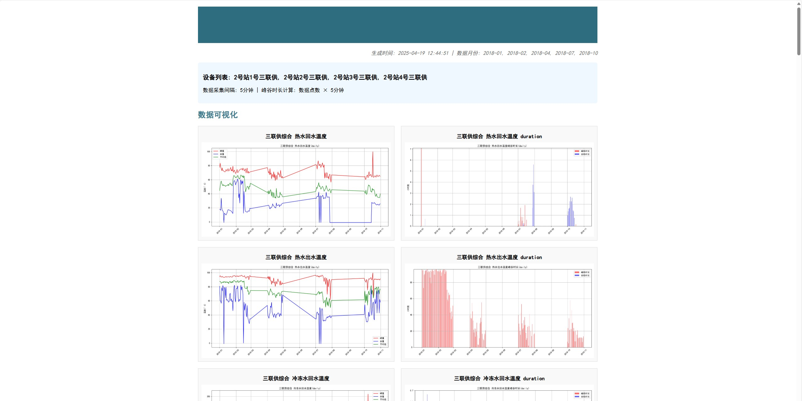

3. 供能预测详情

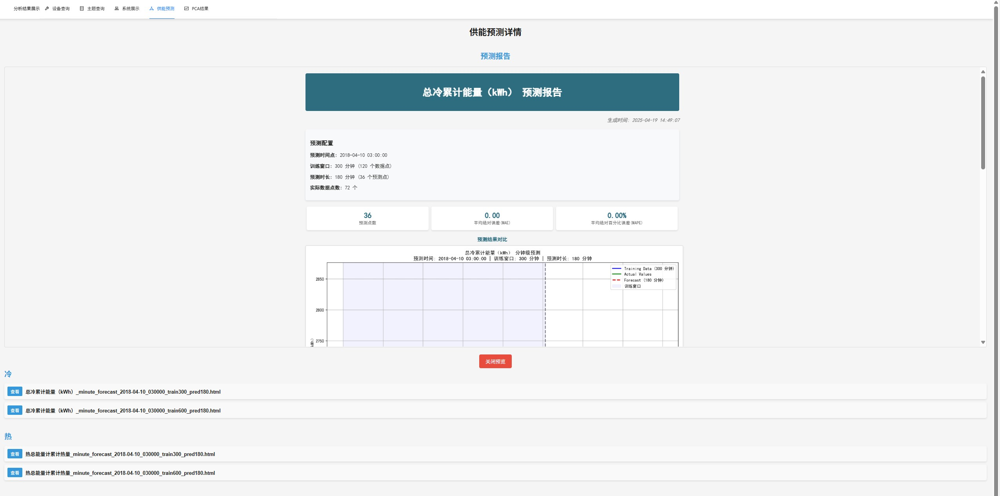

3. PCA 分析结果列表

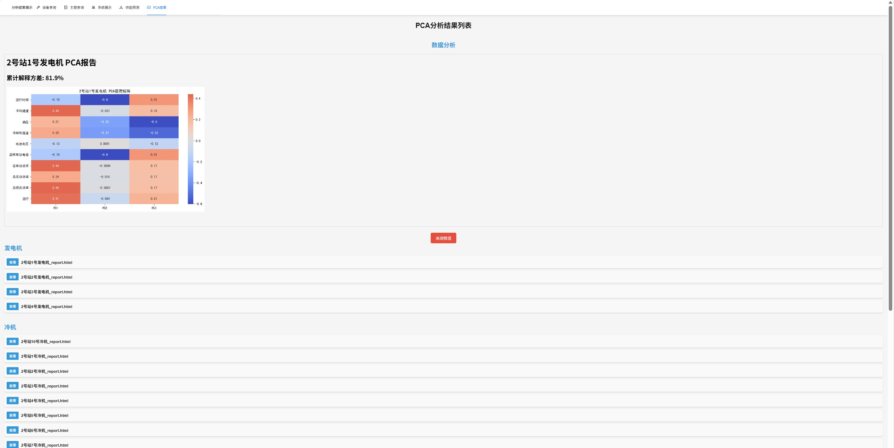

## 展示设计

使用 react + antd chart 进行前端展示，使用 nginx 部署在了服务器上

### 前端展示

1. 设备级数据查询展示界面

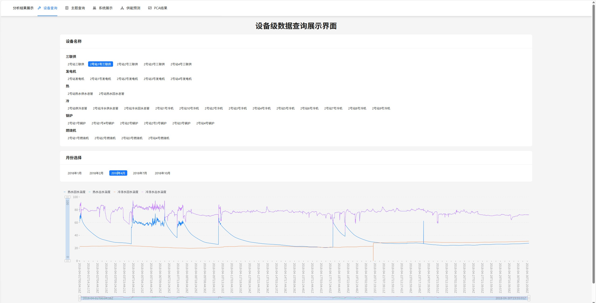

2. 主题级数据查询展示界面

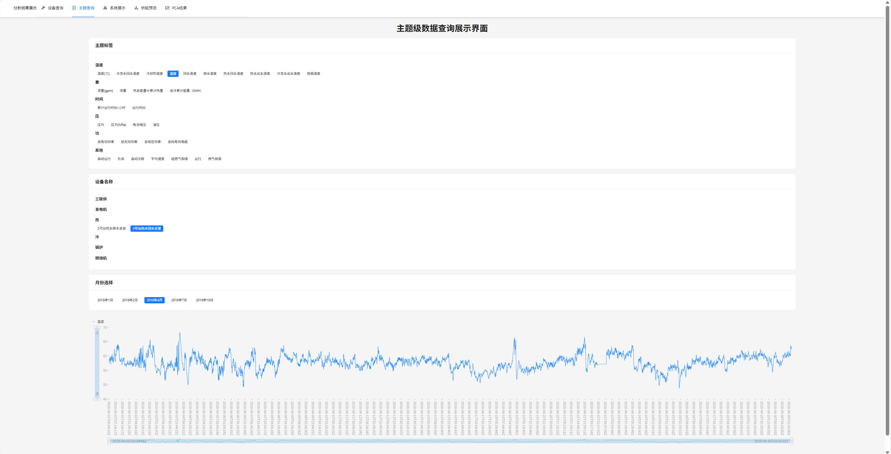

3. 系统实时展示与报表展示

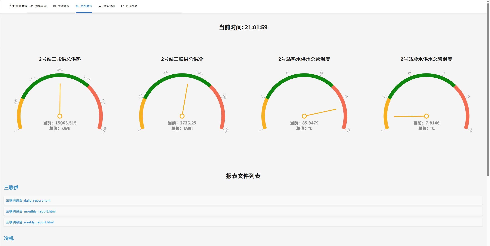

5. 供能预测详情界面

6. PCA 分析结果列表

### Hadoop 管理

1. 集群状态管理

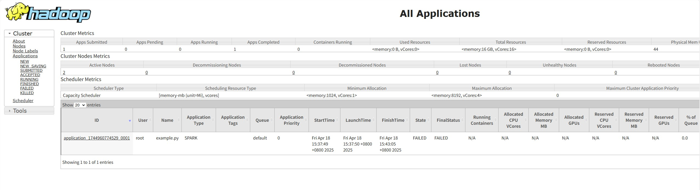

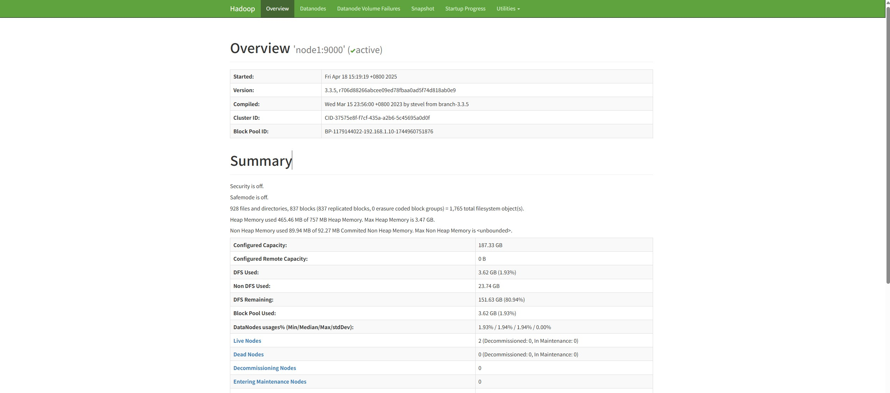

2. 文件系统管理

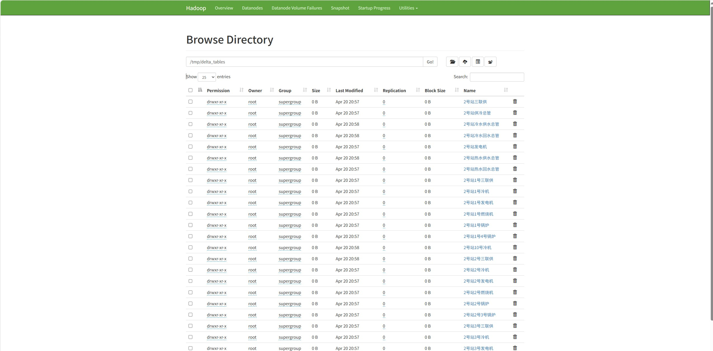

3. 剩余空间查看

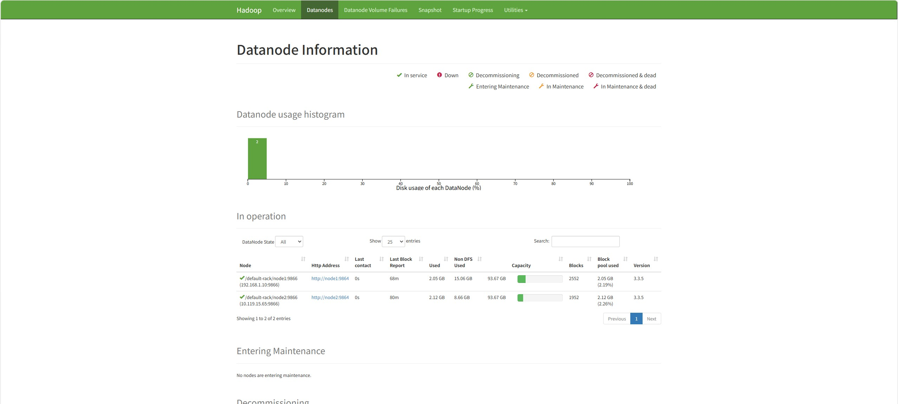

### Spark 管理

1. master 节点状态查看

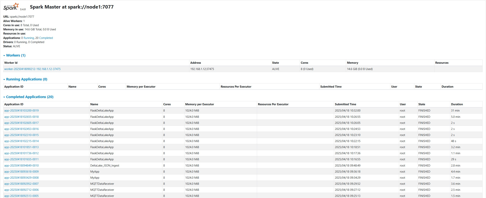

2. worker 节点状态查看

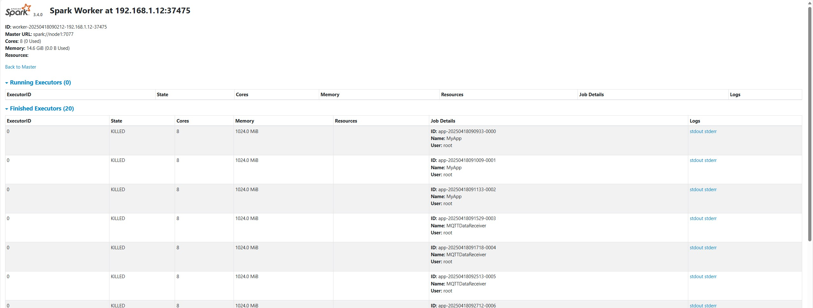

## 源代码

见文件夹

## 演示视频

见文件夹
